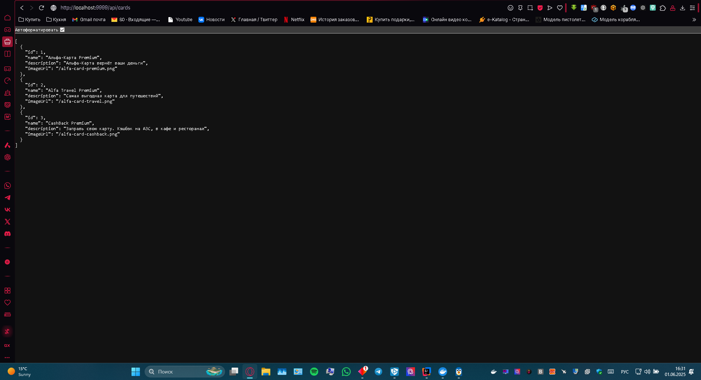

## Описание
Проект запускает приложение с базой данных PostgreSQL в Docker и возвращает JSON-данные о картах по адресу: http://localhost:9999/api/cards

## Запуск
```bash
docker-compose up -d
java -jar db-api.jar



#### 3. **Проверь структуру каталога**
Итоговая структура должна быть такой:
postgresql-test/
├── db-api.jar
├── application.properties
├── docker-compose.yml
├── .gitignore
├── README.md
└── screenshot.png

#### 4. **Инициализируй Git-репозиторий и закоммить**
```bash
git init
git add .
git commit -m "Initial commit with PostgreSQL setup and db-api.jar"